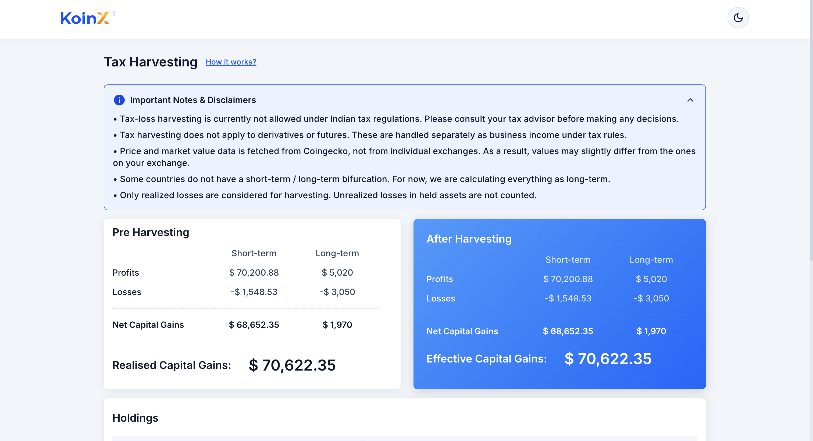
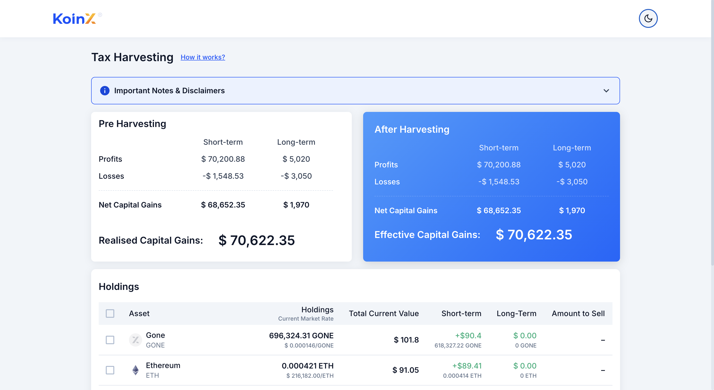

# KoinX — Crypto Tax Loss Harvesting Tool

A high-performance React dashboard designed to help crypto investors optimize their portfolio tax strategies by simulating **Tax Loss Harvesting** (offsetting realized capital gains with realized capital losses).

[](https://react.org/)
[](https://vitejs.dev/)
[](https://www.typescriptlang.org/)

---

## ✨ Features & Interactive Enhancements

* **🎯 Animated Calculations:** Seamless, fluid financial state updates powered by a custom interpolation hook using `requestAnimationFrame`.
* **⚡ One-Click Optimizer:** Instantly selects all loss-making holdings to maximize potential tax savings.
* **💡 Real-Time Impact Badges:** Row-level badges (**↓ Saves $X** or **↑ Costs $X**) showing the direct tax harvesting impact of each asset.
* **🔍 Instant Search & Sort:** Real-time multi-field filtering and sorting by asset names, tickers, or short/long-term gains.
* **🌓 Dual Theme:** Fully responsive layout supporting seamless light and dark mode styling via CSS custom variables.

---

## 🛠️ Architecture & Tech Stack

* **Frontend Framework:** React 19 (TypeScript)
* **Build Tool:** Vite 8
* **Styling:** Vanilla CSS Custom Variables (zero external CSS framework overhead)

```text
src/
├── components/          # UI Components (Header, Table, Cards, Loaders, ErrorState)
├── hooks/               # Custom hooks (theme toggle, smooth number transitions)
├── services/            # Simulated asynchronous Mock API service layer
├── styles/              # Global variables, typography, and component-specific styles
├── types/               # Strict TypeScript definitions & interfaces
└── utils/               # Numerical and currency formatters
```

---

## 🚀 Setup Instructions

To install and run the application locally:

1. **Install dependencies:**
   ```bash
   npm install
   ```

2. **Start the local development server:**
   ```bash
   npm run dev
   ```

3. **Build for production:**
   ```bash
   npm run build
   ```

---

## 📊 Screenshots

**Light Mode**


**Dark Mode**



---

## 📝 Key Assumptions

* **Asset Classification:** Assumes standard tax harvesting logic where short-term losses offset short-term gains first.
* **Mock Data Layer:** Data is loaded asynchronously via a Promise-based mock service to demonstrate loading states and error handling boundaries.
* **Currency Handling:** The application uses **USD ($)** as the primary reporting currency for mock portfolio rates and values.
* **State Management:** Local React state is centralized in `App.tsx` to enable fast, zero-latency rendering of harvesting simulations without the complexity of state management libraries.

---
*Built for the KoinX Internship Challenge.*
